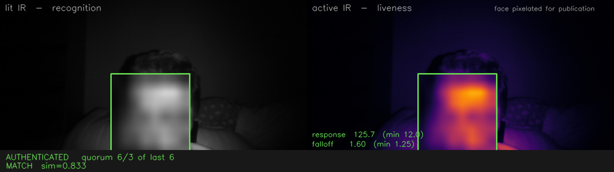

# ir-face-auth

[](LICENSE)
[](SECURITY.md)
[](#)

Face unlock for Linux — login, lock screen, `sudo` and polkit — built around
the fact that Windows Hello cameras **strobe their infrared emitter**, which
turns out to be both the reason they look broken on Linux and the basis for
detecting a photo held up to the camera.

**https://github.com/amir-salmani/ir-face-auth**

> **Experimental.** It works, on one laptop, and it is wired into a real PAM
> stack. But it has no measured false-accept rate and has never been tested
> against a real spoofing attempt. Treat it as a convenience unlock, not a
> security control. [SECURITY.md](SECURITY.md) ·
> [threat model](docs/threat-model.md)



*Left: what the recogniser sees. Right: the same instant with the ambient frame
subtracted, showing the inverse-square falloff a real face produces and a photo
cannot. The face is pixelated for publication —
[regenerate it yourself](scripts/make-screenshot.py).*

| | |
|---|---|
| **What works** | IR capture, liveness, enrollment, matching, PAM integration for GDM / lock screen / sudo / polkit |
| **What is unmeasured** | False-accept rate, resistance to printed photos and screen replay |
| **Tested on** | Exactly one camera — [reports wanted](CONTRIBUTING.md) |

## The finding this is built on

The IR sensor on these laptops (verified on an HP Pavilion Plus 14-ew1xxx with
a Chicony `04f2:b7fe`) alternates its 850nm emitter on and off, one frame each,
at exactly half the frame rate:

```
frame:  0     1    2     3    4     5    6     7
mean:  42.9  0.5  43.0  0.6  42.8  0.7  43.0  0.8
       ^lit  ^amb ^lit  ^amb ^lit  ^amb ^lit  ^amb
```

Two consequences:

1. **The usual "my IR camera is broken on Linux" report is a measurement
   artifact.** Grab one frame and you land on an ambient frame half the time
   and see pure black. This is very likely what
   [linux-enable-ir-emitter#195](https://github.com/EmixamPP/linux-enable-ir-emitter/issues/195)
   actually is. On this hardware the emitter needs no coaxing at all, so none
   of the brute-force UVC extension-unit poking — and none of its documented
   risk of corrupting camera firmware — is necessary.

2. **Subtracting the ambient frame from the lit frame isolates light our own
   emitter put on the subject and got back.** That difference image is the
   basis of the liveness check, and it is something a replay attack cannot
   fabricate.

## Why not just use Howdy

Howdy is the incumbent and deserves credit for proving the idea. It is also
stuck: last release September 2020, no build newer than Ubuntu 25.10, and a
hard dependency on dlib, which needs a C++ toolchain at install time and whose
bindings lag interpreter releases. On Ubuntu 26.04 with Python 3.14 there is no
supported path to install it.

This project takes three different decisions:

| | Howdy | here |
|---|---|---|
| Face stack | dlib (builds from source) | YuNet + SFace, bundled with OpenCV ≥ 4.5 |
| Liveness | none | ambient-subtracted active IR |
| Decision rule | first frame over threshold | quorum of k frames out of n |

The face stack choice is the load-bearing one: OpenCV ships both models and runs
them through its own DNN module, so the runtime dependency list is `opencv` and
`numpy`. Nothing compiles at install time, so nothing rots when Python moves.

## Measured on real hardware

Live subject, this sensor:

```
liveness   response 103-112   (reject below 12)
           falloff  1.53-1.79 (reject below 1.25)
recognition
  enrollment self-similarity   0.742 - 0.986, median 0.912
  fresh session vs enrollment  0.425 - 0.876, median 0.738
```

## Try it

```bash
sudo apt install python3-opencv          # provides YuNet + SFace
PYTHONPATH=src python3 -m irfa.cli doctor
PYTHONPATH=src python3 -m irfa.cli enroll --samples 12
PYTHONPATH=src python3 -m irfa.cli verify
```

## What is not done

Listed honestly, because these are the things that decide whether this is
usable or merely demoable.

- **No impostor data.** Every recognition number above is a genuine-match
  score. Without knowing what a *different* person scores on this sensor, the
  0.45 threshold is a guess, and no false-accept rate can be claimed. This is
  the single most important gap and the next thing to close.
- **Anti-spoofing is untested against actual attacks.** The reasoning for why
  displays and printed photos should fail is sound, and the metrics separate
  cleanly on live faces, but neither attack has been run yet. A shaped
  IR-reflective mask is expected to defeat it and is out of scope.
- **Anti-spoofing thresholds are still unvalidated in deployment.** The PAM
  helper enforces the same `MIN_RESPONSE` / `MIN_FALLOFF` constants that no
  attack session has yet been measured against. Everything in "System
  integration" below inherits that gap.
- **Single hardware sample.** Tested on exactly one camera. The strobe pattern
  and the thresholds may differ on other sensors; `irfa calibrate` exists so
  they can be measured rather than assumed.

## System integration

```bash
sudo packaging/install.sh                    # helper + service user + test service
sudo packaging/enroll-system.sh $USER        # promote enrollment to root-owned store
pamtester irfa-test $USER authenticate       # verify in isolation first
sudo packaging/enable.sh polkit-1            # then enable per service
```

`enable.sh` edits exactly one service at a time and refuses to touch
`common-auth`, because editing that changes GDM, ssh, polkit and every other
consumer simultaneously. Every rule is `sufficient`, so a failed or unavailable
face check falls straight through to the password prompt.

**Rollback is armed before every edit.** A detached root process restores the
original file unless you confirm, within a grace period, that the system still
works — and confirming requires working privileges, so a broken system cannot
disarm its own safety net. `/etc/sudoers` additionally passes `visudo -c`
validation before it is ever installed.

To undo:

```bash
sudo packaging/enable.sh gdm-password --disable
sudo packaging/enable.sh polkit-1 --disable
sudo packaging/enable.sh sudo --disable
sudo packaging/require-sudo-password.sh --restore   # restores NOPASSWD
```

### Privilege split

The helper forks before touching the camera:

| | runs as | handles | can it grant auth? |
|---|---|---|---|
| child | `irfa` (unprivileged, `video` group) | camera I/O, OpenCV, ONNX models — all untrusted input | no |
| parent | root | root-owned enrollment store, comparison, decision | yes |

The child cannot read `/var/lib/irfa` (verified: permission denied). It can only
submit a candidate embedding; root holds the reference data and decides. A
memory-safety bug in a decoder or model parser therefore lands in an
unprivileged process, not in root — the failure mode Howdy is exposed to by
running its whole pipeline as root inside the auth path.

Known residual risk: a compromised child could replay an embedding captured
earlier from the legitimate user. Defeating that needs a trusted path to the
sensor, which this hardware does not provide.

### Caveat: the GNOME keyring

Because the face rule is `sufficient` and sits ahead of `pam_gnome_keyring`, a
successful face match short-circuits the auth stack and the keyring never
receives your password. At the **lock screen** this is harmless — the keyring
was already unlocked at login. At a **cold GDM login** it means the keyring
stays locked and applications needing it will prompt separately. Log in with
your password when you want the keyring unlocked.

## Roadmap

1. Impostor distribution and a threshold derived from a real ROC curve.
2. Spoof testing: phone screen, laptop screen, printed photo, IR-printed photo.
3. Debian packaging.
4. Latency: a match currently takes ~3s, most of it model loading on every
   invocation. A socket-activated daemon holding the models warm would cut it.

## Contributing

The most useful contribution is **not code** — it is data from hardware I do
not own, and attacks I have not tried. See
[CONTRIBUTING.md](CONTRIBUTING.md).

- 🖥️ [Report your camera](../../issues/new?template=hardware-report.yml) — successes and failures both help
- 🎭 [Report a spoofing attempt](../../issues/new?template=spoof-report.yml) — breaking it is a headline result, not a bug report to be embarrassed about
- 🔒 [Security policy](SECURITY.md) · [Code of conduct](CODE_OF_CONDUCT.md)

## Prior art

[Howdy](https://github.com/boltgolt/howdy) proved this idea and deserves the
credit for it. This project exists because Howdy's last release was in 2020 and
its dlib dependency makes it unbuildable on current distros — not because the
idea was wrong. The liveness work here is the part that is genuinely new.

## License

[MIT](LICENSE) — free to use, modify and distribute, including commercially.
